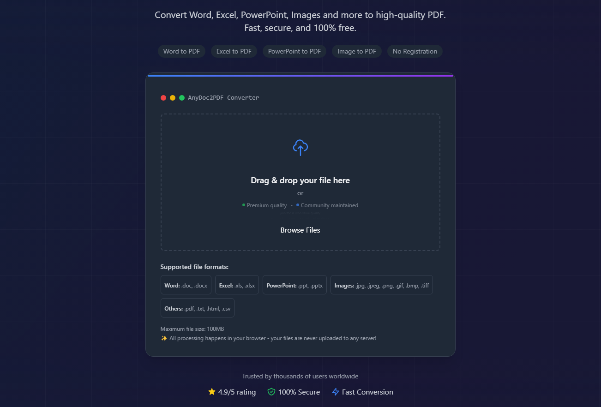
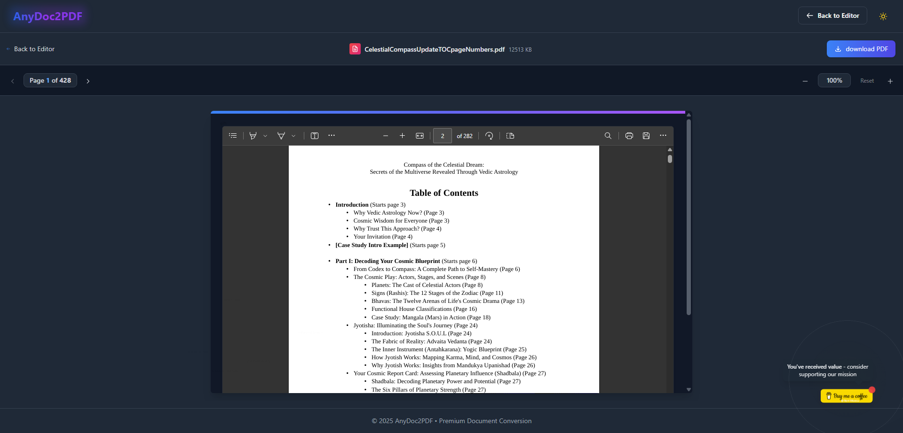

# AnyDoc2PDF

[](https://github.com/RorriMaesu/anyDoc2PDF/stargazers)
[](https://github.com/RorriMaesu/anyDoc2PDF/blob/main/LICENSE)
[](https://www.buymeacoffee.com/rorrimaesu)

<div align="center">
  <a href="https://www.buymeacoffee.com/rorrimaesu" target="_blank">
    
  </a>
  <p><em>Your support enables us to keep this tool <strong>completely free</strong> for everyone</em></p>
</div>

<div align="center">
  
</div>

A premium-quality document-to-PDF converter web application that runs entirely in your browser. Convert any document format to professional-grade PDFs without uploading your files to any server - all processing happens locally in your browser for maximum privacy and security. Join the community of supporters who make this possible!

## 🖼️ PDF Preview

<div align="center">
  
  <p><em>Interactive PDF preview with zoom controls and page navigation</em></p>
</div>

## ✨ Features

- **Multiple Format Support**: Convert various document formats to PDF with ease
- **High-Quality Output**: Professional-grade PDF conversion with perfectly preserved formatting
- **100% Private & Secure**: All processing happens client-side - your files never leave your browser
- **No Registration Required**: No accounts, no email collection, just instant conversion
- **Modern UI**: Elegant, responsive design with smooth animations that delight users
- **Dark Mode Support**: Easy on the eyes with automatic theme detection for comfortable use
- **Completely Free**: No hidden fees, no premium tiers, no limitations - *made possible by [generous supporters](https://www.buymeacoffee.com/rorrimaesu)*
- **Continuous Improvements**: Regular updates and new features - *your [support](https://www.buymeacoffee.com/rorrimaesu) drives our development*

## 📄 Supported File Types

- **Documents**: Word (.docx, .doc), PDF, Rich Text (.rtf)
- **Spreadsheets**: Excel (.xlsx, .xls), CSV
- **Presentations**: PowerPoint (.pptx, .ppt)
- **Images**: JPEG, PNG, GIF, BMP, TIFF, WebP
- **Web**: HTML, MHTML
- **Text**: Plain text (.txt), Markdown (.md)
- **And more**: Support for additional formats is continuously being added

<div align="center">
  <em>Did this tool save you time? <a href="https://www.buymeacoffee.com/rorrimaesu">Consider buying us a coffee</a> ☕</em>
</div>

## 🛠 Technology Stack

- **Frontend Framework**: [React](https://reactjs.org/) - A JavaScript library for building user interfaces
- **Build Tool**: [Vite](https://vitejs.dev/) - Next generation frontend tooling
- **Styling**: [Tailwind CSS](https://tailwindcss.com/) - A utility-first CSS framework
- **Animations**:
  - [Framer Motion](https://www.framer.com/motion/) - A production-ready motion library for React
  - [GSAP](https://greensock.com/gsap/) - Professional-grade animation for the modern web
- **PDF Processing**:
  - [jsPDF](https://github.com/parallax/jsPDF) - Client-side JavaScript PDF generation
  - [pdf-lib](https://github.com/Hopding/pdf-lib) - Create and modify PDF documents in any JavaScript environment
  - [html2canvas](https://github.com/niklasvh/html2canvas) - Screenshots with JavaScript
- **Document Processing**:
  - [mammoth.js](https://github.com/mwilliamson/mammoth.js) - Convert Word documents (.docx files) to HTML
  - [SheetJS](https://github.com/SheetJS/sheetjs) - Spreadsheet Data Toolkit

<div align="right">
  <em>Maintaining these integrations takes time and effort.<br>Your <a href="https://www.buymeacoffee.com/rorrimaesu">support</a> helps us continue this work.</em>
</div>

## Development

### Prerequisites

- Node.js (v16 or higher)
- npm (v8 or higher)

### Installation

1. Clone the repository:
   ```bash
   git clone https://github.com/RorriMaesu/anyDoc2PDF.git
   cd anyDoc2PDF
   ```

2. Install dependencies:
   ```bash
   npm install
   ```

3. Start the development server:
   ```bash
   npm run dev
   ```

4. Open your browser and navigate to the local development server (the exact port may vary):
   ```
   http://localhost:5173/anydoc2pdf/
   ```

### Building for Production

```bash
npm run build
```

The built files will be in the `dist` directory.

## Deployment

This project is configured for GitHub Pages deployment. The included GitHub Actions workflow automatically builds and deploys the application when changes are pushed to the main branch.

### Manual Deployment

If you prefer to deploy manually:

1. Build the project:
   ```bash
   npm run build
   ```

2. Deploy the `dist` directory to GitHub Pages or any static hosting service of your choice.

## 🚀 Performance Optimization

AnyDoc2PDF is meticulously optimized for performance in several ways:

- **Lazy Loading**: Components and libraries are loaded only when needed
- **Code Splitting**: The application is split into smaller chunks for faster loading
- **Optimized Assets**: Images and animations are optimized for web delivery
- **Efficient Rendering**: React's virtual DOM minimizes expensive DOM operations
- **Continuous Refinement**: We're constantly improving performance - *[supporters](https://www.buymeacoffee.com/rorrimaesu) help fund these optimizations*

<div align="center">
  <details>
    <summary><em>Why we need your support</em></summary>
    <p>Maintaining a high-performance, free tool requires significant time and resources. Your support helps us:</p>
    <ul>
      <li>Keep the service completely free for everyone</li>
      <li>Continuously improve performance and features</li>
      <li>Maintain and update dependencies</li>
      <li>Add support for more document formats</li>
    </ul>
    <p><a href="https://www.buymeacoffee.com/rorrimaesu">Support this project</a> ☕</p>
  </details>
</div>

## 🔒 Privacy & Security

We take privacy seriously:

- **No Server Processing**: All document conversion happens in your browser
- **No Data Collection**: We don't collect any personal information or analytics
- **No Cookies**: The application doesn't use cookies or tracking mechanisms
- **Open Source**: The code is open for inspection by anyone

<div align="center">
  <em>Instead of charging for privacy, we rely on <a href="https://www.buymeacoffee.com/rorrimaesu">voluntary support</a> from users who value our work</em>
</div>

## 👪 Contributing

Contributions are welcome! Please feel free to submit a Pull Request.

1. Fork the repository
2. Create your feature branch (`git checkout -b feature/amazing-feature`)
3. Commit your changes (`git commit -m 'Add some amazing feature'`)
4. Push to the branch (`git push origin feature/amazing-feature`)
5. Open a Pull Request

<div align="center">
  <em>Contributors are the backbone of this project.<br>Can't contribute code? <a href="https://www.buymeacoffee.com/rorrimaesu">Financial support</a> helps just as much!</em>
</div>

## 📜 License

This project is licensed under the Apache License - see the [LICENSE](LICENSE) file for details.

<div align="right">
  <sub><sup>Every coffee <a href="https://www.buymeacoffee.com/rorrimaesu">☕</a> helps us maintain this project</sup></sub>
</div>

## ❤️ Acknowledgements

AnyDoc2PDF wouldn't be possible without these amazing open-source projects:

- All the libraries mentioned in the Technology Stack section
- The open-source community for their continuous support and inspiration
- Our [generous supporters](https://www.buymeacoffee.com/rorrimaesu) who make this project sustainable

<div align="center">
  <br>
  <a href="https://www.buymeacoffee.com/rorrimaesu" target="_blank">
    
  </a>
  <p><em>Your support makes a <strong>real difference</strong>.<br>Thank you for helping keep this tool free for everyone!</em></p>
</div>
